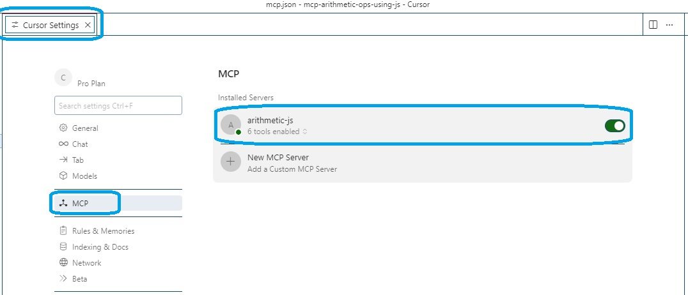
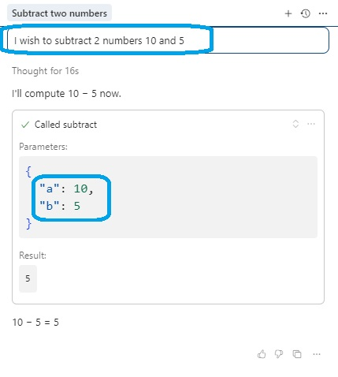

## MCP Arithmetic Server (JavaScript)

A simple Model Context Protocol (MCP) server that exposes arithmetic tools over stdio using `@modelcontextprotocol/sdk`. Tools include: add, subtract, multiply, divide, power, and modulus.

### Requirements
- **Node.js**: v18 or newer (v20+ recommended)
- **npm**: comes with Node.js

### Setup
1. Install dependencies:
```bash
npm install
```

### Validate the server locally (optional)
- Run the server directly to ensure it starts without errors. This is just a validation step; you do not need to keep it running.
```bash
npm run start
```
- You should see a message similar to:
```
mcp-arithmetic-server-js: started and listening on stdio
```
- Press `Ctrl+C` to stop. In normal use, your MCP client (e.g., Cursor) will launch the server when needed.

### Configure in Cursor
Add an entry to your global Cursor MCP config at `%USERPROFILE%\.cursor\mcp.json` (Windows). Example:
```json
{
  "mcpServers": {
    "arithmetic-js": {
      "command": "node",
      "args": [
        "D:/learning/mcp/mcp-arithmetic-ops-using-js/src/index.js"
      ]
    }
  }
}
```
- Adjust the path in `args` if your project is located elsewhere.
- After saving, reload Cursor or restart its MCP session so the server is discovered.

#### Your current Windows config (as provided)
- File: `C:\Users\USERNAME\.cursor\mcp.json`
```json
{
  "mcpServers": {
    "arithmetic-js": {
      "command": "node",
      "args": [
        "D:/learning/mcp/mcp-arithmetic-ops-using-js/src/index.js"
      ]
    }
  }
}
```

#### Verify in Cursor Settings
- Open Cursor Settings → `MCP` → confirm `arithmetic-js` is enabled and green.



### Working example: Subtract 2 numbers in Cursor (via MCP tool)
- Ensure the `arithmetic-js` MCP server is configured and enabled in Cursor.
- In a Cursor chat, type: "Subtract 10 and 5".
- Cursor will invoke the MCP tool `subtract(a, b)` from this server, not the GPT/Claude LLM.
- You should see the tool result indicating `10 − 5 = 5`.



### Available tools
- **add(a, b)**: returns a + b
- **subtract(a, b)**: returns a − b
- **multiply(a, b)**: returns a × b
- **divide(a, b)**: returns a ÷ b (errors on division by zero)
- **power(a, b)**: returns a^b
- **modulus(a, b)**: returns a % b (errors on modulo by zero)

### How it works
- The server is implemented in `src/index.js` using `@modelcontextprotocol/sdk` and validates inputs with `zod`.
- It communicates over stdio (`StdioServerTransport`), which is how MCP clients invoke it.

### Scripts
- **npm run start**: Runs `node src/index.js`. Use this to quickly verify the server launches without errors; it does not need to remain running when used via Cursor or Visual Studio Code or other editor which we use.

### Troubleshooting
- **"node" not recognized**: Ensure Node.js v18+ is installed and available in PATH. Check versions with:
```bash
node -v
npm -v
```
- **Path issues**: On Windows, prefer forward slashes in JSON paths (e.g., `D:/...`) to avoid escape issues.
